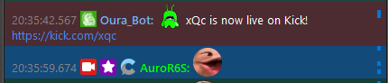
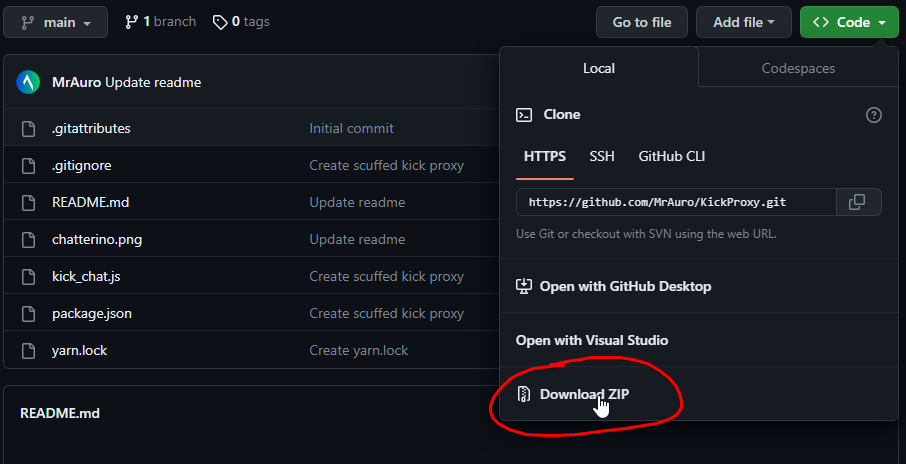

# KickProxy

Scuffed IRC Kick Proxy. Only supports reading messages and **not sending** them. xQc's stream is hardcoded in,
so the provided channel for the IRC connection does nothing. Meant to be used in Chatterino:

## Want to be notified when xQc goes live on Kick in Chatterino? [Add OuraBot for free!](https://ourabot.com) (made by the same developer as KickProxy)

---

## How to setup

1. Install [Node.js](https://nodejs.org/en/download/)
2. Download the zip file

   

3. Extract the zip file
4. Open a terminal in the extracted folder
5. Run `npm install`
6. Run `npm start`
7. Add a new IRC connection in Chatterino with the following settings:

   

---

## Its not working!

1. Make sure you have the latest version of Node.js installed
2. Make sure you have IRC connections enabled in Chatterino (in settings)
3. Make sure you have the correct settings in Chatterino (see above)
4. If you stop recieving messages, restart the proxy and reconnect in Chatterino with CTRL + F5
5. Join my Discord [here](https://discord.gg/ZHqpuszdaM)
